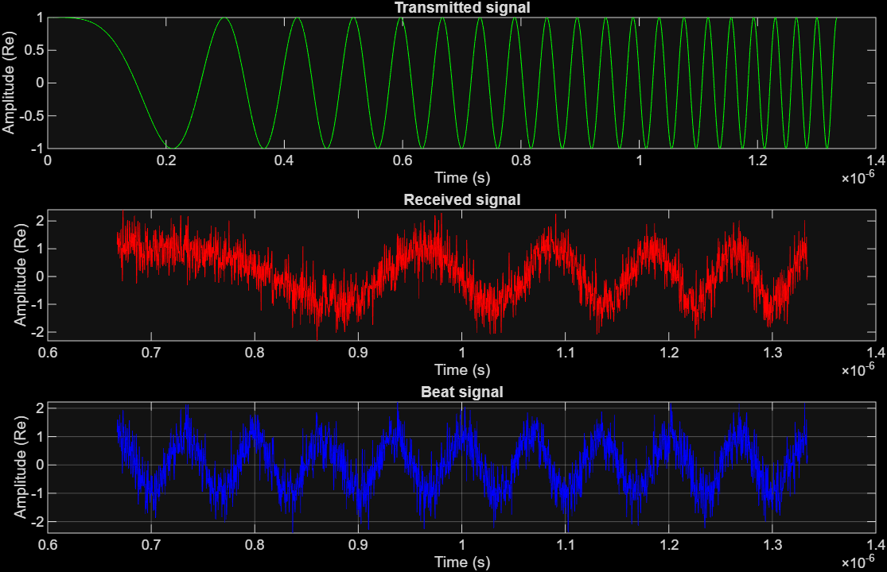
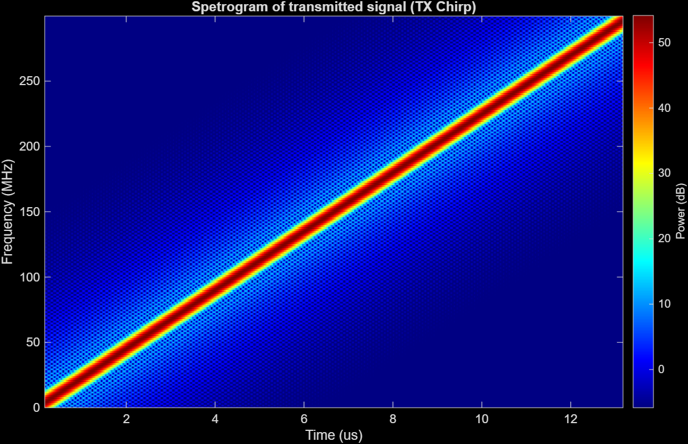
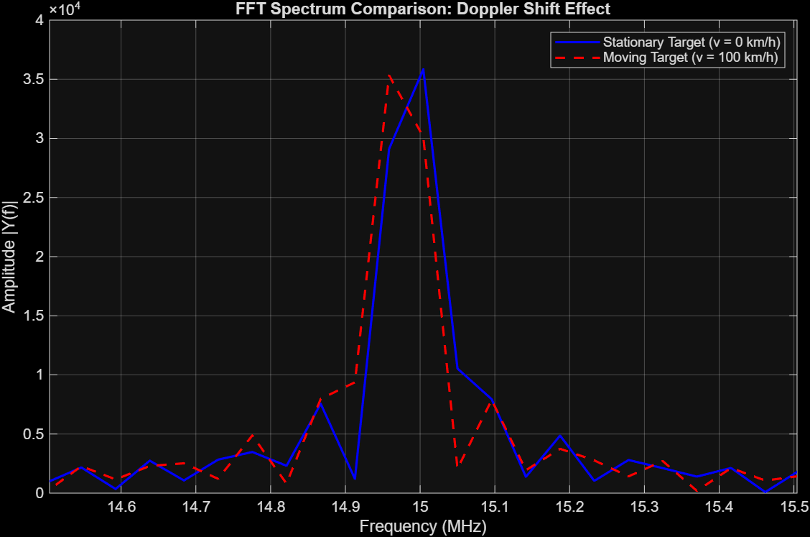
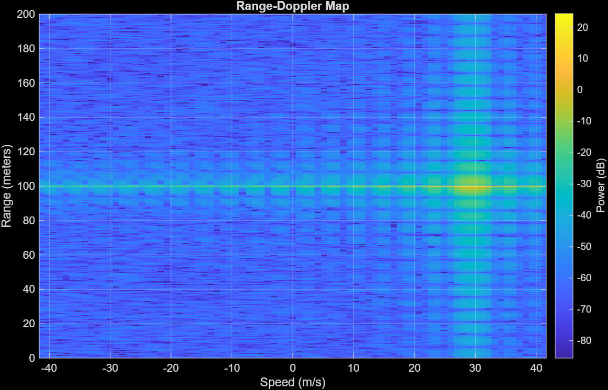

# FMCW Radar Simulation in MATLAB

This repository contains a comprehensive simulation of a Frequency-Modulated Continuous-Wave (FMCW) radar system. The project is divided into two parts to demonstrate both the fundamental signal processing mathematics and a realistic system implementation using MATLAB's Phased Array System Toolbox.

## Project Overview:

**The goal of this project is to simulate the complete radar processing chain:**

* **Signal Generation:** Creating linear frequency modulated (LFM) chirps.
* **Propagation Physics:** Simulating time delay (range) and Doppler shift (velocity).
* **Signal Processing:** Mixing (de-chirping) and performing FFT analysis to detect targets.
* **Hardware Simulation:** Modeling antenna gain, transmitter power, and thermal noise.

## Part 1: Manual Signal Processing (From Scratch)

In this section, the radar logic is built from the ground up using raw mathematical formulas (Euler's formula) without relying on 
high-level radar toolboxes. This demonstrates a deep understanding of the underlying physics.

**Key Concepts Implemented:**

* **Chirp Generation:** Manual creation of the complex baseband signal $e^{j\pi \alpha t^2}$.
* **Echo Simulation:** Modeling the round-trip delay $\tau$ and Doppler shift $f_d$.
* **De-chirping:** Implementing the mixer mathematically as `Beat = Rx * conj(Tx)`.
* **Spectral Analysis:** Using FFT to extract range information from the beat frequency.

**Results:**

**Beat signal:** "Beat Signal" is obtained by mixing the transmitted and received signals.

**Transmitted Signal (Spectrogram):** The spectrogram below visualizes the linear frequency ramp (Up-Chirp) generated in the simulation. 
The frequency increases linearly over time, covering the bandwidth required for the target resolution.

**Spectrum comparison:** 

>As illustrated above, a single chirp measurement results in **Range-Doppler ambiguity**.
 The frequency shift caused by distance and velocity is superimposed in a single spectrum,
>making it impossible to decouple these two parameters without a chirp sequence.

## PART 2: Phased Array System Toolbox Implementation

This section upgrades the simulation to a professional level using MATLAB's System Objects. It introduces realistic hardware constraints and advanced processing for moving targets.

**System Configuration:**

* Frequency: 77 GHz (Automotive standard)
* Bandwidth: Calculated for 0.5 m range resolution.
* Hardware: Includes antenna aperture ($6.06 \text{ cm}^2$), gain calculations, and receiver noise figure ($4.5 \text{ dB}$).
* Processing: Range-Doppler processing using 2D-FFT on a frame of 64 chirps.

**Simulation scenario:**

* Radar Velocity: 10 km/h
* Target Velocity: -96 km/h (Closing in / Head-on scenario) or Receding.
* Environment: Free space path loss model with Radar Cross Section (RCS) simulation.

**Results: Range-Doppler Map**

The final output is a Range-Doppler Map generated by processing a coherent processing interval (CPI) of 64 pulses.

* X-Axis: Velocity (Relative speed of the target).
* Y-Axis: Range (Distance to the target).
* Color: Signal power (dB).

The map clearly distinguishes the target based on both its distance and relative velocity, resolving the range-velocity ambiguity inherent in single-chirp processing.

## Why all this matters in Robotics? 

Understanding raw radar data processing is a prerequisite for implementing robust Sensor Fusion algorithms (e.g., fusing Radar point clouds with Camera data via Kalman 
Filters) in autonomous mobile robots.